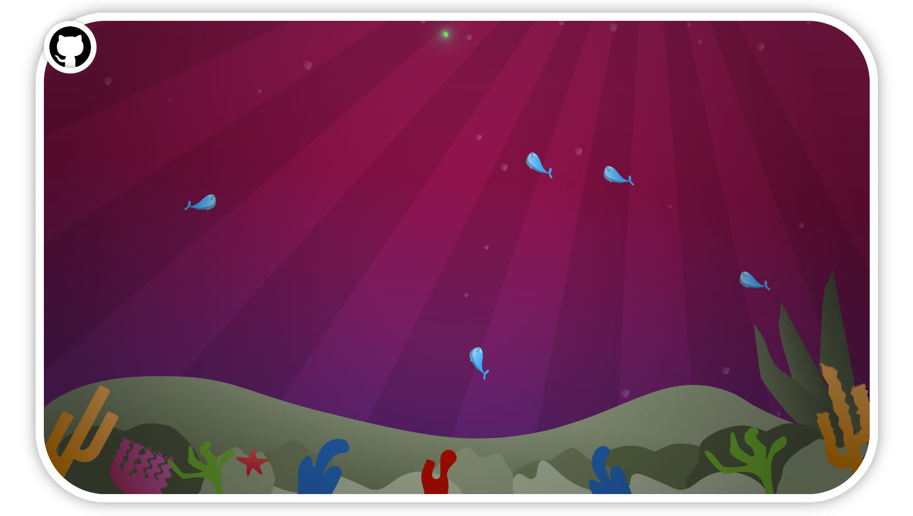

# Aquarium

A cute fish tank game built in React 🐟  
Raise your fish, feed them. But be careful not to let them die!

## Live demo
[https://alonlevim.github.io/aquarium/](demo)

## Building the project

The project is a simple. To build the whole project, just run npm install from the root directory.

## Running the game

To see what the game does, run `npm install` as described above, then run `npm run`. The application will be running on [http://localhost:3000](http://localhost:3000)
